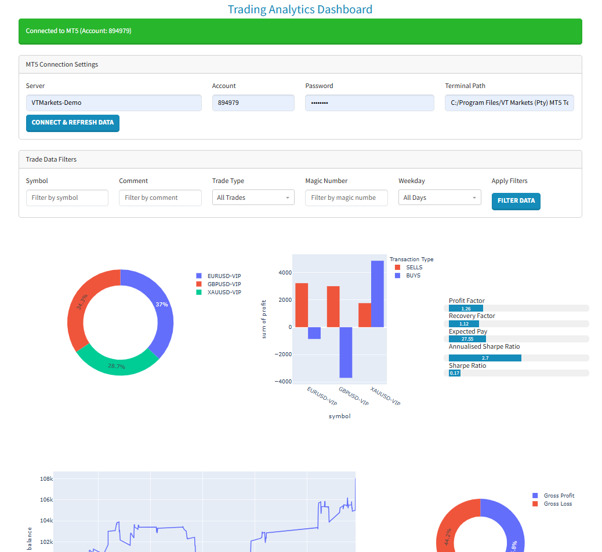

# Trading Analytics Dashboard


*Example dashboard interface*

## Table of Contents
- [Overview](#overview)
- [Features](#features)
  - [Core Functionality](#core-functionality)
  - [Visualisations](#visualisations)
  - [Key Metrics](#key-metrics)
- [Installation](#installation)
  - [Prerequisites](#prerequisites)
  - [Setup](#setup)
- [Usage](#usage)
- [Code Customisation](#code-customisation)
- [Technical Details](#technical-details)
  - [Architecture](#architecture)
  - [Data Flow](#data-flow)
  - [Key Dependencies](#key-dependencies)
- [Troubleshooting](#troubleshooting)
  - [Common Issues](#common-issues)
  - [Debugging Tips](#debugging-tips)
- [Contributing](#contributing)

## Overview

The Trading Analytics Dashboard is a Python web application that connects to MetaTrader 5 (MT5) to visualize and analyse trading performance. It provides:

- Interactive charts and metrics
- Comprehensive trade analysis
- Filtering capabilities
- Performance benchmarking

## Features

### Core Functionality
- Real-time connection to MT5 terminal
- Historical trade data analysis
- Multi-dimensional filtering system

### Visualisations
- **Symbol Distribution**: Pie chart of trades by symbol
- **Profit Analysis**: Histogram of profitable vs losing trades
- **Balance Growth**: Line chart of account balance over time
- **Profit/Loss Donut**: Visual breakdown of gross profit vs loss

### Key Metrics
- Profit Factor
- Recovery Factor 
- Sharpe Ratio (daily and annualized)
- Expected Payout
- Win/Loss Ratios
- Average Trade Duration

## Installation

### Prerequisites

- Python 3.8 or higher
- MetaTrader 5 installed
- MT5 account credentials
- Chrome or Firefox browser

### Setup

1. Clone the repository:
   ```
   git clone https://github.com/slim-o/trading-analytics-dashboard.git
   cd trading-analytics-dashboard
2. Install dependencies:
   ```
   pip install -r requirements.txt

### Usage
1. Launch the application:
   ```
   python luci_dash.py
2. Access the dashboard at:
   ```
   http://127.0.0.1:8050
3. Connect to MT5:

   - Enter your server, account number, and password
   - Specify the path to your MT5 terminal executable
   - Click "Connect & Refresh Data"

4. Use filters to analyze specific trade subsets:

   - Filter by symbol, comment, or magic number

   - Select trade types (BUYS/SELLS)

   - Filter by weekday

### Code Customisation

Key parameters to adjust:

    ```
    # In luci_dash.py
    from_date = datetime(2020, 1, 1)  # Adjust start date for historical data 
    to_date = datetime.now() + timedelta(days=1)

    # Chart styling
    empty_pie = px.pie(..., hole=0.7)  # Adjust donut chart hole size

### Technical Details
#### Architecture

   - Frontend: Dash (Python framework built on React.js)

   - Backend: Flask

   - Visualisation: Plotly

   - Styling: Dash Bootstrap Components

#### Data Flow
1. MT5 Terminal → func_general_functions.py

2. Data Processing → luci_dash.py

3. Visualisation → Browser

#### Key Dependencies
   - Dash v3.0.3

   - MetaTrader5 v5.0.4874

   - Pandas v2.2.3

   - Plotly v6.0.1

### Troubleshooting
#### Common Issues

| Error| Solution    |
| :---:   | :---: |
| Connection timeout| Verify MT5 terminal is running|
| "No deals in history" | Adjust date range in code |
| Chart display issues | Refresh browser cache |
| Missing dependencies	 | Reinstall requirements.txt
 |

Debugging Tips
1. Check terminal for Python errors

2. Verify MT5 login credentials

3. Ensure correct terminal path format:

   Windows: `C:/Program Files/MetaTrader 5/terminal64.exe`

### Contributing
We welcome contributions! Please follow these guidelines:

1. Fork the repository

2. Create a feature branch (git checkout -b feature/improvement)

3. Commit changes (git commit -m 'Add new feature')

4. Push to branch (git push origin feature/improvement)

5. Open a Pull Request
